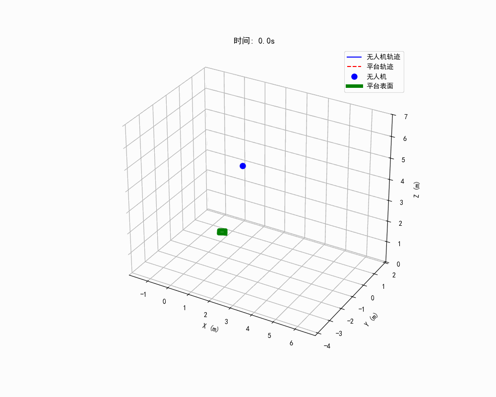
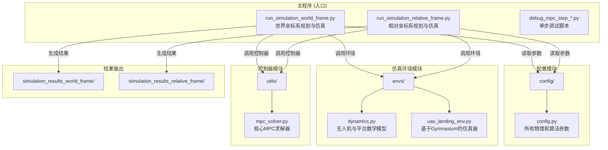

# 无人机动态着陆MPC控制器仿真平台

本项目是一个基于**模型预测控制（MPC）**的仿真平台，用于研究四旋翼无人机在**移动平台**上的自主着陆问题。平台内置了两种主流的控制策略，并提供了完整的仿真、测试和可视化工具链，以进行深入的算法研究与性能对比。

该平台使用Python语言，核心算法库包括 `NumPy`（科学计算）、`CasADi`（非线性优化）和 `Gymnasium`（仿真环境框架）。




*(这是一个示例动画，实际运行结果将保存在 `simulation_results_*` 目录下)*

## 核心特性

- **模型预测控制 (MPC)**：利用系统的动力学模型，在有限的时间域内对未来状态进行预测，并求解一个最优控制问题，以实现滚动优化。
- **两种控制策略实现**：
    1.  **世界坐标系规划** (`run_simulation_world_frame.py`): 在统一的全局惯性系中进行状态预测和轨迹规划，鲁棒性强，是业界标准方法。
    2.  **相对坐标系规划** (`run_simulation_relative_frame.py`): 在与平台固连的浮动坐标系中进行规划，将跟踪问题简化为镇定问题，概念上更简洁。
- **动态目标预测**：两种策略都利用平台的动力学模型和已知的控制输入，预测出未来一段时间内的运动轨迹，从而解决了跟踪动态目标时的滞后问题。
- **模块化设计**：项目结构清晰，将仿真环境、动力学模型、控制器和配置文件解耦，便于维护和扩展。
- **参数化仿真**：用户可以通过修改主仿真脚本中的参数，轻松定义各种复杂的着陆场景，测试控制器的鲁棒性。
- **详细的可视化**：自动生成3D轨迹图、关键状态曲线图和GIF动画，便于直观分析控制器性能。

---

## MPC问题构建与代价函数推导

本项目的核心是构建一个非线性规划（NLP）问题，并使用IPOPT等求解器进行求解。其标准形式如下：

$$
\begin{aligned}
\min_{\mathbf{z}} \quad & J(\mathbf{z}) = \frac{1}{2} \mathbf{z}^T \mathbf{H} \mathbf{z} + \mathbf{g}^T \mathbf{z} \\
\text{s.t.} \quad & \mathbf{g}_{lb} \le \mathbf{G}(\mathbf{z}, \mathbf{p}) \le \mathbf{g}_{ub} \\
& \mathbf{z}_{lb} \le \mathbf{z} \le \mathbf{z}_{ub}
\end{aligned}
$$

其中：
- $\mathbf{z}$ 是**决策变量**，包含了整个预测时域内的所有状态和控制输入。
- $\mathbf{p}$ 是**参数**，包含了初始状态和代价函数的权重。
- $J(\mathbf{z})$ 是**代价函数**，我们希望最小化它。
- $\mathbf{G}(\mathbf{z}, \mathbf{p})$ 是**约束函数**，主要包括系统动力学约束。

### 1. 决策变量 $\mathbf{z}$ 的定义

决策变量 $\mathbf{z}$ 是一个长向量，它将预测时域 $N$ 内的所有状态 $X$ 和控制输入 $U$ 堆叠而成：
- $X = [\mathbf{x}_0, \mathbf{x}_1, ..., \mathbf{x}_N]$，其中 $\mathbf{x}_k \in \mathbb{R}^{10}$ 是第 $k$ 步的状态。
- $U = [\mathbf{u}_0, \mathbf{u}_1, ..., \mathbf{u}_{N-1}]$，其中 $\mathbf{u}_k \in \mathbb{R}^{4}$ 是第 $k$ 步的控制。

$$
\mathbf{z} = \begin{bmatrix} \text{vec}(X) \\ \text{vec}(U) \end{bmatrix} \in \mathbb{R}^{10(N+1) + 4N}
$$

### 2. 代价函数 $J$ 的推导

我们的目标是让无人机状态 $\mathbf{x}_k$ 尽可能地接近参考状态 $\mathbf{x}_{ref,k}$，同时让控制量 $\mathbf{u}_k$ 尽可能小。这可以用一个二次型代价函数来表示：

$$
J = \sum_{k=0}^{N-1} \left( (\mathbf{x}_{k+1} - \mathbf{x}_{ref,k})^T \mathbf{Q} (\mathbf{x}_{k+1} - \mathbf{x}_{ref,k}) + \mathbf{u}_k^T \mathbf{R} \mathbf{u}_k \right)
$$

其中 $\mathbf{Q}$ 和 $\mathbf{R}$ 是正定对角权重矩阵。为了将其转换为NLP的标准形式，我们展开这个表达式：

$$
J = \sum_{k=0}^{N-1} \left( \mathbf{x}_{k+1}^T \mathbf{Q} \mathbf{x}_{k+1} - 2\mathbf{x}_{ref,k}^T \mathbf{Q} \mathbf{x}_{k+1} + \text{const} \right) + \sum_{k=0}^{N-1} \left( \mathbf{u}_k^T \mathbf{R} \mathbf{u}_k \right)
$$

由于常数项不影响优化结果，我们可以忽略它。将上式与NLP目标函数 $\frac{1}{2} \mathbf{z}^T \mathbf{H} \mathbf{z} + \mathbf{g}^T \mathbf{z}$ 对比，我们可以得到二次项矩阵 $\mathbf{H}$ 和线性项向量 $\mathbf{g}$ 的对应关系：
- **二次项**: $\frac{1}{2} \mathbf{z}^T \mathbf{H} \mathbf{z}$ 对应于 $\sum (\mathbf{x}^T \mathbf{Q} \mathbf{x} + \mathbf{u}^T \mathbf{R} \mathbf{u})$。因此，$\mathbf{H}$ 的对角线上对应于 $\mathbf{x}_{k+1}$ 的部分是 $2\mathbf{Q}$，对应于 $\mathbf{u}_k$ 的部分是 $2\mathbf{R}$。
- **线性项**: $\mathbf{g}^T \mathbf{z}$ 对应于 $\sum (-2\mathbf{x}_{ref,k}^T \mathbf{Q} \mathbf{x}_{k+1})$。因此，$\mathbf{g}$ 向量中对应于 $\mathbf{x}_{k+1}$ 的部分是 $-2\mathbf{Q}\mathbf{x}_{ref,k}$。

### 3. **向量化实现 (本项目采用)**

在实践中，$\mathbf{Q}$ 和 $\mathbf{R}$ 都是对角阵。这意味着我们可以用权重向量 $\mathbf{q}_{weights}$ 和 $\mathbf{r}_{weights}$ 来表示它们。代价函数可以被更高效地计算：
- $\mathbf{x}^T \mathbf{Q} \mathbf{x} = \sum_{i} q_i x_i^2$
- $\mathbf{x}_{ref}^T \mathbf{Q} \mathbf{x} = \sum_{i} q_i x_{ref,i} x_i$

基于此，我们直接构建NLP求解器所需的**权重向量**，而不是庞大的稀疏矩阵 $\mathbf{H}$。
- **二次项权重向量 `Q_nlp_vec`**:
  - `Q_nlp_vec`的每个元素对应于 $\mathbf{z}$ 中每个元素的二次代价权重。
  - 对于 $\mathbf{z}$ 中的 $\mathbf{x}_{k+1}$ 部分，其权重为 $2 \times \mathbf{q}_{weights}$。
  - 对于 $\mathbf{z}$ 中的 $\mathbf{u}_k$ 部分，其权重为 $2 \times \mathbf{r}_{weights}$。
- **线性项权重向量 `p_nlp`**:
  - `p_nlp`的每个元素对应于 $\mathbf{z}$ 中每个元素的线性代价权重。
  - 对于 $\mathbf{z}$ 中的 $\mathbf{x}_{k+1}$ 部分，其权重为 $-2 \times \mathbf{q}_{weights} \odot \mathbf{x}_{ref,k}$ (其中 $\odot$ 是逐元素乘法)。

这种向量化的实现避免了构建和操作大型稀疏矩阵，显著提高了代码的可读性和计算效率。

---

## 项目结构



### 文件/模块详解

*   **`config/config.py`**: 项目的中央配置文件，定义了所有重要的物理和算法参数，如无人机质量、MPC预测时域、代价函数权重等，便于快速调整。
*   **`envs/`** (仿真环境模块):
    *   **`dynamics.py`**: 包含了无人机和移动平台的数学动力学模型。
    *   **`uav_landing_env.py`**: 基于 `Gymnasium` 框架搭建的仿真环境。它封装了动力学模型，负责在每个时间步更新无人机和平台的状态，并提供绝对状态（`info`）和相对状态（`obs`）。
*   **`utils/mpc_solver.py`**: **项目的核心**。它使用 `CasADi` 构建并求解非线性MPC问题。求解器内部的动力学模型基于**惯性参考系**建立。
*   **主仿真与调试脚本**:
    *   **`run_simulation_world_frame.py`**:
        *   **策略**: 在固定的世界坐标系（惯性系）中进行所有预测和规划。
        *   **流程**: 获取无人机的**世界坐标系状态** -> 预测平台在**世界坐标系**中的未来轨迹 -> 生成无人机在**世界坐标系**中的参考轨迹 -> 送入MPC求解。
        *   **优点**: 物理模型与控制框架完全匹配，鲁棒性高，是处理此类问题的标准方法。
    *   **`run_simulation_relative_frame.py`**:
        *   **策略**: 在每个时间步，将平台当前的坐标系视为一个临时的、固定的“瞬时惯性系”进行规划。
        *   **流程**: 获取无人机的**相对位置/姿态**和**修正后的惯性速度** -> 在此临时坐标系中预测平台的“虚拟”轨迹 -> 生成旨在将无人机驱动回原点的参考轨迹 -> 送入MPC求解。
        *   **优点**: 将复杂的跟踪问题转化为一个更直观的镇定问题（稳定到原点），在理论上也是可行的。
    *   **`debug_mpc_step_*.py`**: 用于单步调试的脚本，分别对应上述两种策略。它们不运行完整仿真，只执行一次MPC计算并打印所有中间结果，非常适合用于快速验证算法逻辑。

---

## 控制策略对比与讨论

本项目最初的探索发现，直接将`相对速度`喂给基于`惯性速度`建立的MPC模型会导致失败。经过修正，`relative_frame`版本现在将无人机的**世界惯性速度**转换到平台坐标系下，解决了这一矛盾。

现在，两种方法都能成功着陆，并产生非常相似的结果。这验证了一个重要的控制理论概念：

> 无论是选择一个固定的全局惯性系（世界坐标系法），还是在每个时间步定义一个瞬时局部惯性系（相对坐标系法），只要保证送入MPC求解器的**状态（特别是速度）**与求解器内部的**惯性动力学模型**在物理意义上保持一致，控制器就能正确工作。

- **世界坐标系法**: 更通用，逻辑更直接，推荐作为主要开发和测试框架。
- **相对坐标系法**: 提供了一种不同的问题视角，展示了将跟踪问题转化为镇定问题的可能性，对于理解坐标系变换和相对运动非常有价值。

---

## 如何运行与自定义测试

### 环境依赖
确保已安装以下Python库：
```bash
pip install numpy gymnasium matplotlib casadi tqdm pillow scipy
```

### 运行仿真
你可以选择运行任意一种控制策略的仿真脚本：

**运行世界坐标系下的规划仿真:**
```bash
python run_simulation_world_frame.py
```
结果将保存在 `simulation_results_world_frame` 文件夹。

**运行相对坐标系下的规划仿真:**
```bash
python run_simulation_relative_frame.py
```
结果将保存在 `simulation_results_relative_frame` 文件夹。

### 自定义测试场景
打开任一 `run_simulation_*.py` 文件，找到 `if __name__ == "__main__":` 代码块下的 `simulation_params` 字典。你可以通过修改其中的值来设计任意复杂的着陆场景。

```python
# --- 1. 定义测试场景 ---
simulation_params = {
    # 无人机初始状态
    'quad_init_position': np.array([2.0, -1.5, 5.0]),          # 初始位置 [x, y, z] (米)
    'quad_init_velocity': np.array([0.0, 0.0, 0.0]),          # 初始速度 [vx, vy, vz] (米/秒)
    'quad_init_quaternions': euler_to_quaternion(0, 0, np.deg2rad(0)),

    # 平台初始状态与运动控制
    'platform_init_state': np.array([0.0, 0.0, 0.8, np.deg2rad(30)]), # 初始状态 [x, y, 速度v, 偏航角psi]
    'platform_u1': 0.2,                                             # 平台的纵向加速度 (米/秒²)
    'platform_u2': np.deg2rad(-30.0)                                # 平台的转向角 (弧度)
}
```
通过组合这些参数，你可以轻松模拟静态着陆、直线跟踪、加/减速跟踪以及最具挑战性的曲线跟踪等各种场景。