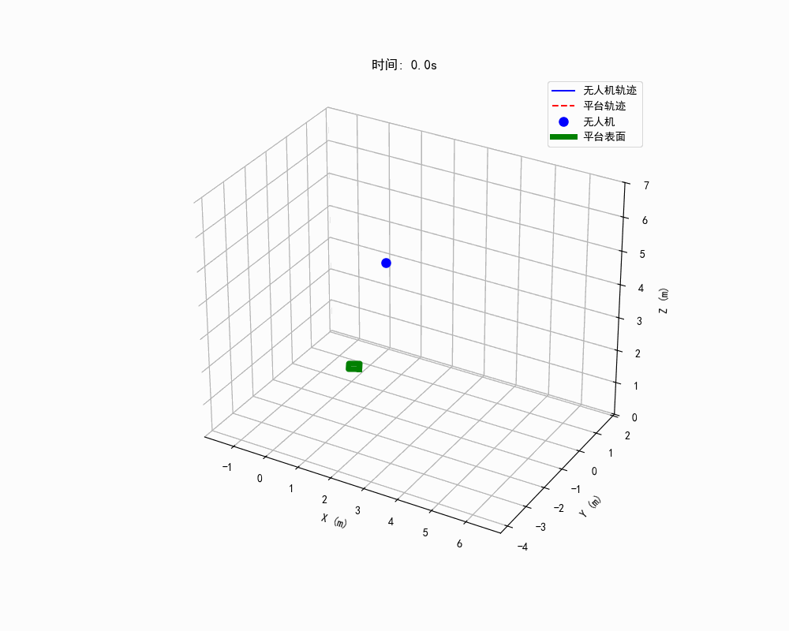
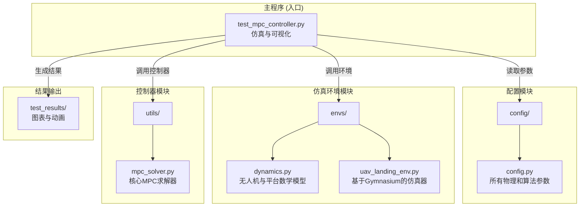

# 无人机动态着陆MPC控制器仿真平台

本项目是一个基于**模型预测控制（MPC）**的仿真平台，用于研究四旋翼无人机在**移动平台**上的自主着陆问题。控制器采用先进的**动态轨迹预测**策略，能够实现对复杂运动目标的精准跟踪和着陆。

该平台使用Python语言，核心算法库包括 `NumPy`（科学计算）、`CasADi`（非线性优化）和 `Gymnasium`（仿真环境框架）。




*(这是一个示例动画，实际运行结果将保存在 `test_results` 目录下)*

## 核心特性

- **模型预测控制 (MPC)**：利用系统的动力学模型，在有限的时间域内对未来状态进行预测，并求解一个最优控制问题，以实现滚动优化。
- **动态目标预测**：控制器不再将平台当前位置作为静态目标，而是利用平台的动力学模型和已知的控制输入，预测出未来一段时间内的运动轨迹。
- **动态参考轨迹生成**：将预测出的平台轨迹作为MPC的动态参考目标，使无人机能够“预见”平台的运动并提前规划，从根本上解决了跟踪动态目标时的滞后问题。
- **自适应控制器接口**：代价函数的权重矩阵 `Q_nlp` 和线性项 `p_nlp` 作为外部参数传入求解器，为集成自适应算法（如神经网络）提供了无缝接口。
- **模块化设计**：项目结构清晰，将仿真环境、动力学模型、控制器和配置文件解耦，便于维护和扩展。
- **参数化仿真**：用户可以通过修改主测试脚本中的参数，轻松定义各种复杂的着陆场景，测试控制器的鲁棒性。

## 项目结构



### 文件/模块详解

#### 1. `config/config.py`
这是项目的中央配置文件。它定义了所有重要的物理参数和算法参数，使得调整模型和算法行为无需修改核心代码。
- **`Quadrotor` 类**: 定义无人机的物理属性，如质量、推重比、最大角速度等。
- **`MovingPlatform` 类**: 定义移动平台的物理属性，基于自行车模型，包含前后轴距、最大速度等。
- **`MPC` 类**: 定义MPC控制器的核心参数，如预测时域`HORIZON`，以及状态和控制量的基础权重矩阵 `STATE_WEIGHTS` 和 `CONTROL_WEIGHTS`。
- **`Termination` 类**: 定义仿真成功或失败的判断标准，如最大允许的着陆误差和速度。

#### 2. `envs/` (仿真环境模块)
- **`dynamics.py`**: 包含了无人机和移动平台的数学动力学模型。
    - **四旋翼模型**: 基于牛顿-欧拉方程，使用四元数表示姿态。
    - **移动平台模型**: 基于简化的自行车模型，适用于低速车辆。

- **`uav_landing_env.py`**: 基于 `Gymnasium` 框架搭建的仿真环境。它封装了动力学模型，负责在每个时间步更新无人机和平台的状态，并检查终止条件。在本项目中，它主要扮演一个**仿真器**的角色。

#### 3. `utils/` (工具与算法模块)
- **`mpc_solver.py`**: **项目的核心**。它使用 `CasADi` 构建并求解非线性MPC问题。
    - **问题构建**: 将无人机的动力学模型、状态/控制约束和目标函数转化为一个标准的非线性规划（NLP）问题。
    - **目标函数**: 为了提高灵活性和与高级优化算法的兼容性，目标函数被转换为标准的NLP形式，其中 `z` 是包含了所有预测状态和控制的决策向量：
      $$
      J = \frac{1}{2} \mathbf{z}^T \mathbf{Q_{nlp}} \mathbf{z} + \mathbf{p_{nlp}}^T \mathbf{z}
      $$
      **与之前版本不同，二次项矩阵 `Q_nlp` 和线性项向量 `p_nlp` 不在求解器内部固定，而是作为外部参数动态传入**。这使得控制器可以实时调整其优化目标，例如根据不同的飞行阶段或环境变化来改变权重，是实现自适应控制的关键。
    - **求解**: 调用 `IPOPT` 求解器找到最优的控制序列 $\mathbf{U}^* = \{\mathbf{u}_0^*, ..., \mathbf{u}_{N-1}^*\}$。
    - **滚动优化**: 只将第一个最优控制 $\mathbf{u}_0^*$ 应用于系统，然后在下一个时间步重复整个过程。

#### 4. `test_mpc_controller.py`
这是项目的主入口和测试脚本。它负责：
1.  **定义测试场景**: 设置无人机和平台的初始状态及运动参数。
2.  **初始化**: 创建仿真环境和MPC控制器实例。
3.  **运行仿真循环**: 在每个时间步，执行以下关键操作：
    - 获取当前状态。
    - **预测平台未来轨迹** (`predict_platform_trajectory`)。
    - **生成动态参考轨迹** (`generate_mpc_reference_trajectory`)。
    - **构建代价函数参数**: 根据参考轨迹，显式计算 `Q_nlp` 和 `p_nlp` 的数值。*此步骤演示了如何使用灵活的求解器接口，未来可被替换为神经网络的输出来实现自适应控制*。
    - 调用MPC求解器获得最优控制。
    - 将控制指令应用到环境中。
    - 记录数据。
4.  **结果可视化**: 仿真结束后，生成3D轨迹图、状态曲线图和GIF动画，并保存到 `test_results` 目录。

## 如何运行与自定义测试

### 环境依赖
确保已安装以下Python库：
```bash
pip install numpy gymnasium matplotlib casadi tqdm pillow scipy
```

### 运行测试
直接在终端中运行主测试脚本即可：
```bash
python test_mpc_controller.py
```
仿真结束后，所有结果将自动保存在 `test_results` 文件夹中。

### 自定义测试场景
打开 `test_mpc_controller.py` 文件，找到 `if __name__ == "__main__":` 代码块下的 `simulation_params` 字典。你可以通过修改其中的值来设计任意复杂的着陆场景。

```python
# --- 1. 定义测试场景 ---
# 这个场景中，平台不仅有初速度，还有加速度和转向输入，是一个典型的动态跟踪任务。
simulation_params = {
    # 无人机初始状态
    'quad_init_position': np.array([2.0, -1.5, 5.0]),          # 初始位置 [x, y, z] (米)
    'quad_init_velocity': np.array([0.0, 0.0, 0.0]),          # 初始速度 [vx, vy, vz] (米/秒)
    'quad_init_quaternions': euler_to_quaternion(0, 0, np.deg2rad(0)), # 初始姿态 (通常保持水平)

    # 平台初始状态与运动控制
    'platform_init_state': np.array([0.0, 0.0, 0.8, np.deg2rad(30)]), # 初始状态 [x, y, 速度v, 偏航角psi]
    'platform_u1': 0.2,                                             # 平台的纵向加速度 (米/秒²)
    'platform_u2': np.deg2rad(-30.0)                                # 平台的转向角 (弧度)
}
```

#### 参数详解：

- **`quad_init_position`**: 无人机的三维起始位置。你可以把它设置在平台的任何相对位置，测试控制器的跟踪能力。
- **`quad_init_velocity`**: 无人机的初始速度。可以设置为非零值，模拟无人机在运动中开始执行着陆任务。
- **`quad_init_quaternions`**: 无人机的初始姿态。通常使用 `euler_to_quaternion` 函数将其设置为水平姿态。

- **`platform_init_state`**: 平台的四维初始状态。
    - `[x, y]`: 平台的起始位置。
    - `速度v`: 平台的初始速度大小（沿车头方向）。
    - `偏航角psi`: 平台的初始朝向（弧度）。

- **`platform_u1`**: 平台的**纵向加速度**。
    - `> 0`: 平台加速。
    - `< 0`: 平台减速。
    - `= 0`: 平台匀速运动。

- **`platform_u2`**: 平台的**前轮转向角**（弧度）。这个值在整个仿真过程中保持不变。
    - `> 0`: 平台向左转弯。
    - `< 0`: 平台向右转弯。
    - `= 0`: 平台直线运动。

通过组合这些参数，你可以轻松模拟各种场景，例如：
- **静态着陆**: 设置平台速度、加速度和转向角均为0。
- **直线跟踪**: 设置平台有初速度，但加速度和转向角为0。
- **加/减速跟踪**: 设置非零的 `platform_u1`。
- **曲线跟踪**: 设置非零的 `platform_u2`，这是最具挑战性的场景。